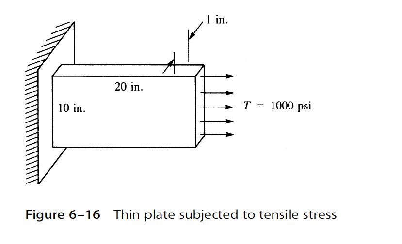
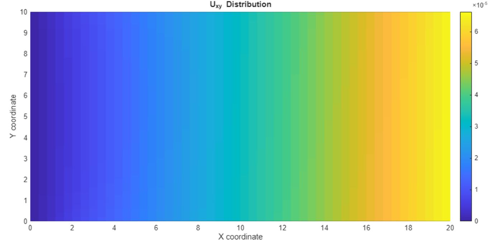
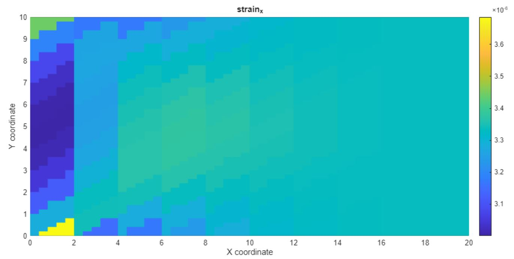
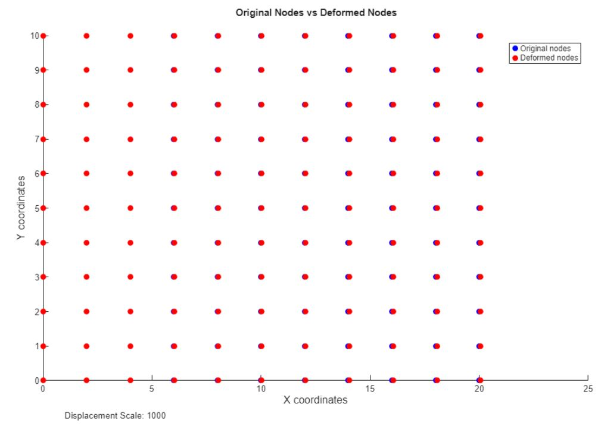

# Implementation of FEM for a 2D Plate using CST Elements under the Plane Stress Assumption (MATLAB)

This project implements the Finite Element Method (FEM) for 2D plates using Constant Strain Triangle (CST) elements under the plane stress assumption.  
The solution corresponds to the problem illustrated in figure 6.16.

This problem is based on chapter 6.5 of the book:  
*A First Course in the Finite Element Method* by **Daryl L. Logan**.

## Features

- FEM implementation with CST elements.  
- Visualization of displacements, stresses, and strains of the plate.  
- Scalable visualization of node deformations.  
- Comparison of the solution using a single-element model.

## Requirements

- MATLAB R2025a Update 1 or later

## Usage

1. Open MATLAB.  
2. Open the script `fem_cst.m` or the Jupyter Notebook `fem_cst.ipynb` using MATLAB.  
3. Run all cells to reproduce the solution.

## Example

For a 10×10 mesh with the following values:
t = 1;            % thickness [in]
E = 30*10^6;      % Young’s modulus [psi]
v = 0.3;          % Poisson’s ratio
n_x = 10; 
n_y = 10;
n_element_x = 5; 
n_element_y = 5;
x0 = 0; 
y0 = 0;
x1 = 20; 
y1 = 10;
p = -1000;        % Load [psi]
displacement_scale = 1000;

Expected outputs include:

- Displacement in x.
- Strain in x.
- Deformed mesh grid. 

Example results:

## Repository Structure

* **`fem_cst.ipynb`**: The main Jupyter Notebook for the project, demonstrating the FEM analysis.
* **`fem_cst.m`**: An equivalent MATLAB script of the main FEM program.
* **`barycentric_lambda.m`**: A MATLAB function to compute barycentric coordinates for a triangle.
* **`constitutive_matrix.m`**: A MATLAB function for generating the material's constitutive matrix.
* **`local_stiffness_matrix.m`**: A MATLAB function that calculates the local stiffness matrix.
* **`strain_displacement_matrix.m`**: A MATLAB function that defines the strain-displacement matrix B.
* **`two_area_triangle.m`**: A MATLAB utility function to compute the area of a triangle.
* **`u_x_y.m`**: A MATLAB function that determines displacements inside a given element.
* * **`figure1.JPG`**: An image illustrating the initial problem setup.
* **`figure1_u_x_y_example.JPG`**: An example image showing the displacement results.
* **`figure2_strain_x_example.JPG`**: An example image showing the strain results.
* **`figure3_deformed_nodes_example.JPG`**: An example image of the deformed mesh nodes.

## Reproducibility

- Clone this repository.
- Open the MATLAB script or notebook.
- Run all cells and compare results with the included images.
- 
## Author
Developed by Nicolas Quiñones 
